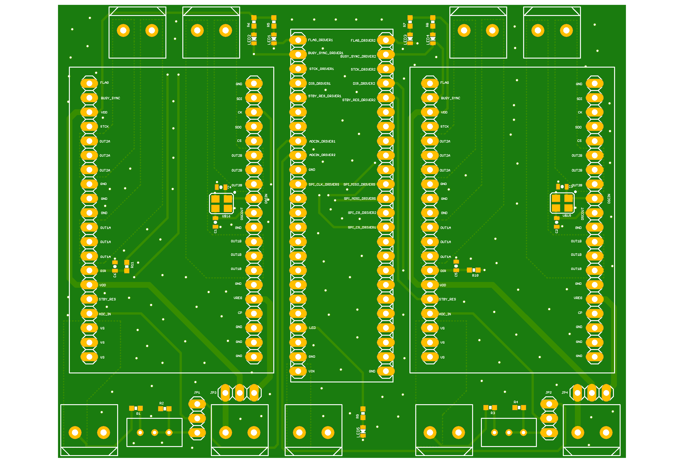

# motors_motherBoard
## Carrier board for dual *[STM's L6470](https://www.st.com/en/motor-drivers/l6470.html)* stepper motor driver controller with *[Teensy 3.6](https://www.pjrc.com/teensy/)* interface. This project was applied for control a two-wheel differential drive mobile robot.

